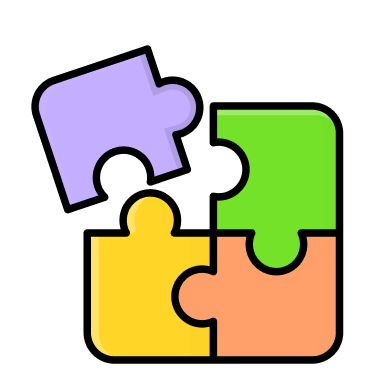

<a name="readme-top"></a>
<!-- PROJECT SHIELDS -->
<!--
*** I'm using markdown "reference style" links for readability.
*** Reference links are enclosed in brackets [ ] instead of parentheses ( ).
*** See the bottom of this document for the declaration of the reference variables
*** for contributors-url, forks-url, etc. This is an optional, concise syntax you may use.
*** https://www.markdownguide.org/basic-syntax/#reference-style-links
-->
[![Contributors][contributors-shield]][contributors-url]
[![Forks][forks-shield]][forks-url]
[![Stargazers][stars-shield]][stars-url]
[![Issues][issues-shield]][issues-url]


<!-- PROJECT LOGO -->
<br />
<div align="center">
  <a href="https://github.com/hanhkiet/puzzle">
    
  </a>

<h3 align="center">Math Puzzle</h3>

  <p align="center">
    A math game for all ages
  </p>
</div>


<!-- TABLE OF CONTENTS -->
<details>
  <summary>Table of Contents</summary>
  <ol>
    <li>
      <a href="#about-the-project">About The Project</a>
      <ul>
        <li><a href="#built-with">Built With</a></li>
      </ul>
    </li>
    <li>
      <a href="#getting-started">Getting Started</a>
      <ul>
        <li><a href="#prerequisites">Prerequisites</a></li>
        <li><a href="#installation">Installation</a></li>
      </ul>
    </li>
    <li><a href="#usage">Usage</a></li>
    <li><a href="#roadmap">Roadmap</a></li>
    <li><a href="#contributing">Contributing</a></li>
    <li><a href="#license">License</a></li>
    <li><a href="#contact">Contact</a></li>
    <li><a href="#acknowledgments">Acknowledgments</a></li>
  </ol>
</details>


<!-- ABOUT THE PROJECT -->
## About The Project
<div align="center">
  <table>
  <tr>
    <td></td>
    <td></td>
    <td></td>
  </tr>
</table>
</div>


<p align="right">(<a href="#readme-top">back to top</a>)</p>


### Built With

* [![Flutter][Flutter]][Flutter-url]
* [![AndroidStudio][AndroidStudio]][AndroidStudio-url]

<p align="right">(<a href="#readme-top">back to top</a>)</p>


<!-- GETTING STARTED -->
## Getting Started

How to run the app ?

### Using source code

Download source code and run
* cmd
  ```sh
  flutter pub get
  ```
After all the packages are downloaded , run the app on a Android device !
### Installation
1. Requirement : <ul>
    <li>compileSdkVersion : 34</li>
    <li>minSdkVersion : 21</li>
    <li>targetSdkVersion : 34</li>
  </ul>
2. Download file .apk in here to install the app directly : <a href="https://github.com/hanhkiet/puzzle/releases/tag/v1.0.0">Here</a> </br>
3. Install it in a Android devices and enjoy the game !
<p align="right">(<a href="#readme-top">back to top</a>)</p>


## Features

- [x] Math Puzzle
  - [x]  Calculator
  - [x]  Guess The Sign
  - [x]  Correct Answer
  - [x]  Quick Calculation
  - [x]  Find Missing
  - [x]  True False
  - [x]  Complex Calculation
  - [x]  Duel Game ( Which require 2 people to against each other )
- [x] Memory Puzzle
  - [x] Mental Arithmetic
  - [x] Square Root
  - [x] Math Grid
  - [x] Mathematical Pairs
  - [x] Cube Root
  - [x] Concentration    
- [x] Train Your Brain
  - [x] Magic Triangle
  - [x] Picture Puzzle
  - [x] Number Pyramid
  - [x] Numeric Memory
- [x]  Multiple Language ( Vietnamese/English)
- [x]  Theme ( Dark/Light mode )
- [x]  Feedback


<p align="right">(<a href="#readme-top">back to top</a>)</p>


<!-- CONTACT -->
## Contact

VuDucTruong - 21520507@gm.uit.edu.vn
HuynhAnhKiet - 19520664@gm.uit.edu.vn

Project Link: [https://github.com/hanhkiet/puzzle](https://github.com/hanhkiet/puzzle)

<p align="right">(<a href="#readme-top">back to top</a>)</p>


<!-- MARKDOWN LINKS & IMAGES -->
<!-- https://www.markdownguide.org/basic-syntax/#reference-style-links -->
[contributors-shield]: https://img.shields.io/github/contributors/hanhkiet/puzzle.svg?style=for-the-badge
[contributors-url]: https://github.com/hanhkiet/puzzle/graphs/contributors
[forks-shield]: https://img.shields.io/github/forks/hanhkiet/puzzle.svg?style=for-the-badge
[forks-url]: https://github.com/hanhkiet/puzzle/network
[stars-shield]: https://img.shields.io/github/stars/hanhkiet/puzzle.svg?style=for-the-badge
[stars-url]: https://github.com/hanhkiet/puzzle/stargazers
[issues-shield]: https://img.shields.io/github/issues/hanhkiet/puzzle.svg?style=for-the-badge
[issues-url]: https://github.com/hanhkiet/puzzle/issues
[product-screenshot]: https://github.com/hanhkiet/puzzle/assets/113105084/d3030032-3004-4f94-b2e3-74ac9be328aa
[Flutter]: https://img.shields.io/badge/Flutter-02569B?style=for-the-badge&logo=flutter&logoColor=white
[Flutter-url]: https://flutter.dev/
[AndroidStudio]: https://img.shields.io/badge/Android_Studio-3DDC84?style=for-the-badge&logo=android-studio&logoColor=white
[AndroidStudio-url]: https://developer.android.com/studio?gad_source=1&gclid=CjwKCAjwg8qzBhAoEiwAWagLrGUAJYHayXAdGunG29dmUbSKGRxCWtBsl2Jgzqi8qypKKKRmiCYpXRoCqq8QAvD_BwE&gclsrc=aw.ds

